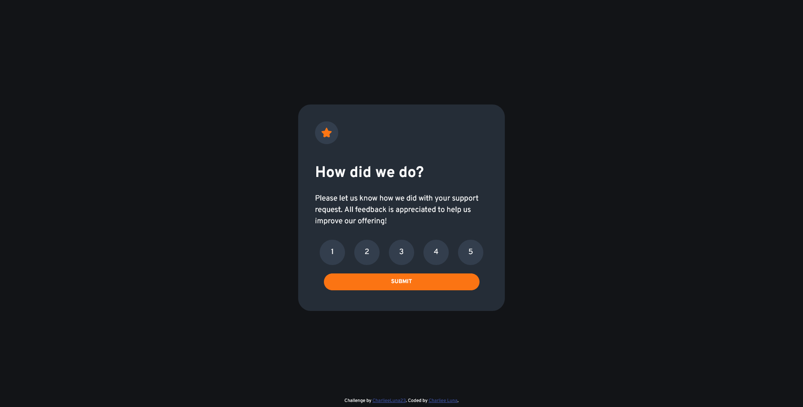

# Frontend Mentor - Interactive rating component solution

This is a solution to the [Interactive rating component challenge on Frontend Mentor](https://www.frontendmentor.io/challenges/interactive-rating-component-koxpeBUmI). Frontend Mentor challenges help you improve your coding skills by building realistic projects. 

## Table of contents

- [Overview](#overview)
  - [The challenge](#the-challenge)
  - [Screenshot](#screenshot)
  - [Links](#links)
- [My process](#my-process)
  - [Built with](#built-with)
  - [What I learned](#what-i-learned)
  - [Continued development](#continued-development)
  - [Useful resources](#useful-resources)
- [Author](#author)
- [Acknowledgments](#acknowledgments)

**Note: Delete this note and update the table of contents based on what sections you keep.**

## Overview

### The challenge

Users should be able to:

- View the optimal layout for the app depending on their device's screen size
- See hover states for all interactive elements on the page
- Select and submit a number rating
- See the "Thank you" card state after submitting a rating

### Screenshot

### Links

- Solution URL: (https://github.com/CharlieeLuna23/interactive-rating.git)
- Live Site URL: (https://charlieeluna23.github.io/interactive-rating/)

## My process

### Built with

- Semantic HTML5 markup
- CSS custom properties
- Flexbox
- Mobile-first workflow

### What I learned

This project was 2 months away from my last FrontEnd Mentor challenge project. Honestly I didn't learned anything new but I was able to finally upload a project using JS after 2 months of studying.

### Continued development

I would like to more efficiently write JS code.

### Useful resources

- [Example resource 1](https://www.udemy.com/course/modern-javascript-from-the-beginning/) - This is one of the courses I've been following on JS and it was really helpful. I got the loading screen idea from here.

## Author

- FreeCodeCamp - [CharlieeLuna](https://www.freecodecamp.org/CharlieeLuna)
- Frontend Mentor - [@CharlieeLuna23](https://www.frontendmentor.io/profile/CharlieeLuna23)
- Twitter - [@CharlieeLuna](https://twitter.com/CharlieeLuna)

## Acknowledgments

## Acknowledgments

Once again to my cats for making me company during this learning process and path and my girlfriend who is currently waiting for me to finish the project so we can play videogames.

